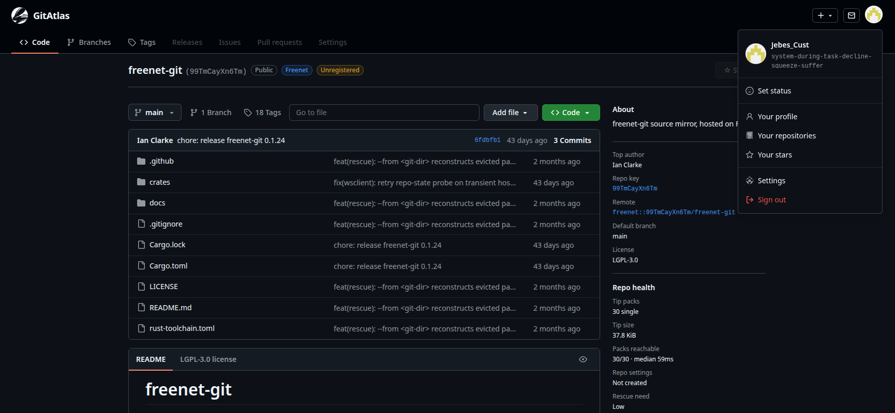

# GitForge

**GitForge** is a forge for git hosted on [Freenet](https://freenet.org) —
browse, publish, and collaborate without a central GitHub-style server.
Repositories live as Freenet contracts via
[`freenet-git`](https://github.com/freenet/freenet-git); GitForge is the UI
and the Hub contracts that make that usable day to day.



## Why it exists

- **Decentralized forge UX** — Discover, profiles, stars, settings, and tip-pack
  Code browse against your local Freenet node.
- **Identity you own** — Create / restore / download a freenet-git identity
  bundle; ForgeVault and profile helpers ride with that identity, they are not a
  lock-in account.
- **Publish to test** — The real surface is a Freenet website contract, not a
  local Express/Vite loop.

## Working today

| Area | What works |
|------|------------|
| **Website SPA** | Published Freenet website contract (`npm run publish:website`) |
| **Discover** | Seed demos + ForgeRegistry listings (signed-in home) |
| **Identity** | Create, recovery phrase, import bundle, identity.bundle download, sign-out |
| **ForgeVault** | Passwordless vault auto-provision; Settings → Sync (vault ↔ this node) |
| **Repos** | New empty repo, import, register on Hub, tip-pack Code / Commits / Tags / Branches |
| **Stars** | ForgeStars contract; star / unstar; profile Stars tab |
| **People** | Profile overview, repositories, stars |
| **Languages** | Linguist-style sidebar bar over tip blobs |
| **License / community files** | LICENSE detection and related helpers |
| **Repo health** | Pack / Hub reachability + rescue paths |
| **Inbox** | Profile inbox for system / invite-style messages |
| **API keys** | Vault-scoped keys for CLI helpers (`gitforge vault`) |
| **Repo CLI** | `gitforge repo` — about / register / unregister / rename / soft-delete via local delegate |
| **Downloads** | Re-export identity / related downloads from Settings |

## Design notes

- **Identity bundle first** — The downloadable freenet-git CLI bundle is the
  main credential and offline recovery path.
- **ForgeVault** — Sealed settings and repo keys sync with the signed-in identity
  so a Freenet sandbox wipe does not erase your vault index. Sign-out clears
  the local session; signing back in with the same identity reattaches vault
  state when it is still on the network.
- **Tip-pack browse** — Code view streams tipped packs over the node WebSocket
  (IndexedDB + wasm), not a full local clone.
- **Hosting reality** — Freenet nodes keep contracts warm under demand. Tip packs
  and other contracts can go cold if nothing on *this* node is retaining them;
  rescue cannot invent bytes that local eviction already dropped. Keep important
  work reachable from your node (use, republish, or other retention you trust).

## Layout

```
gitforge/
├── browse-tool/       # tip pack helper
├── decode-wasm/       # RepoState helpers for the browser
├── contracts/         # ForgeRegistry, ForgeVault, ForgeStars, ForgeRepo, …
├── delegates/         # forge-identity, forge-pages
├── docs/                # architecture notes + preview images
├── freenet-linguist/  # language bar
├── freenet-licensee/  # LICENSE detection
├── scripts/           # publish / owner-tool helpers
├── web/               # React SPA
├── attic/             # retired local :8787 API
└── README.md
```

## Prerequisites

- Freenet node (network mode)
- `fdev` on `PATH`
- `freenet-git` / `git-remote-freenet` for CLI git ops
- Node.js 20+, Rust toolchain (WASM / tip helper)

## Setup

```sh
git clone https://github.com/AlecMcCutcheon/gitforge.git
cd freenet-gitforge
npm install
```

## Publish (primary test surface)

```sh
# Node already running (e.g. systemctl --user start freenet)

npm run build:owner
bash scripts/publish-owner-tools.sh   # after owner WASM changes

npm run publish:website
```

Open the URL from the publish output (typically
`http://127.0.0.1:7509/v1/contract/web/<key>/`) and hard-refresh.

See [`docs/08-website-publish.md`](docs/08-website-publish.md).

| Variable | Default | Meaning |
|----------|---------|---------|
| `GITFORGE_WEBSITE_KEY` | `gitforge` | `fdev website` key name |
| `FREENET_WS_URL` | `ws://127.0.0.1:7509/v1/contract/command` | Node WS |
| `GITFORGE_PAGES_BASE` | `http://127.0.0.1:7509/v1/contract/web` | Pages base URL |

## Community

**River chat (GitForge room invite):**  
http://127.0.0.1:7509/v1/contract/web/raAqMhMG7KUpXBU2SxgCQ3Vh4PYjttxdSWd9ftV7RLv/?invitation=2mPwJjYYGuUU3pWxcatqBVmMRfvPpc9LUnr71kP6PTD1epT2AEnJ8TSD1EnLvK2txmbgge1XHAdP38gfcFqLaDeWyYbs9jmXEGgh29Uiho1kCujNGjhp47amuJMQ1ckwrDXJ8myZbsdYQbA1TvcZMm6KnWcPKPU8eH4y23h2Lj8A2WzdM3LREzDKSuv4fYUZSpTFYDbkSn61ZLzBeSXMbXwMVLjtEreLG21LtxPNxNphNrNYmsMGd28RDiaQedZrhdwZyHs1TV6DVrVs2bqbUw94GVWPbfG1R5JvwZnByCPQ7a13eaRw3eUjNchAMDpLa6VWzf1MmGD6XpNTFbBW8h8J5paSSZU1Yfng4QiZnRZTgfM8uFyERPufzr2T6JX9QAnyYWxMNtat9dF7c7gCRYbm8gMsYh9quQNPD69LuEsxXTmJhv77DP6h3z9LeevqPywCHycs9udd2Gdf2LaBFHy2FQ15

## Contributing

Please read [`CONTRIBUTING.md`](CONTRIBUTING.md) before opening a feature PR.
**Features and behavior changes need an approved issue first** (silence is not
approval). See also [`AGENTS.md`](AGENTS.md) for layout and conventions.

## License

**LGPL-3.0-only** — same family as freenet-git app tooling. See [`LICENSE`](LICENSE).

## Docs

[`docs/05-gitforge-content-architecture.md`](docs/05-gitforge-content-architecture.md),
[`docs/06-forge-registry.md`](docs/06-forge-registry.md),
[`docs/08-website-publish.md`](docs/08-website-publish.md),
[`docs/09-forge-pages.md`](docs/09-forge-pages.md),
[`docs/10-forge-vault-auth.md`](docs/10-forge-vault-auth.md),
[`docs/11-forge-stars.md`](docs/11-forge-stars.md).
