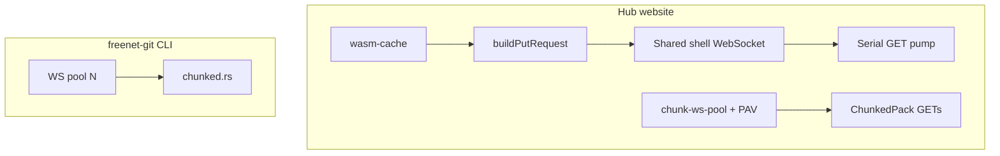

# Freenet-git WebSocket hygiene (Hub SPA)

Lessons from upstream [freenet-git](https://github.com/freenet/freenet-git) transport work
([releases v0.1.11–v0.1.12](https://github.com/freenet/freenet-git/releases)),
mapped onto GitAtlas website-mode Puts/Gets. Large-pack design background:
[freenet-git `docs/0001-large-repos.md`](../../freenet-git/docs/0001-large-repos.md).

## Hub vs CLI transport

| | freenet-git CLI | Hub SPA |
|--|-----------------|---------|
| Connections | Pool of N WebSockets (default 8, `FREENET_GIT_PARALLEL_OPS`) | One shared shell WS ([`ws.ts`](../web/src/freenet/ws.ts)) + aux chunk GET pool |
| ChunkedPack **fetch** | Parallel GETs across pool | Parallel via [`chunk-ws-pool.ts`](../web/src/freenet/chunk-ws-pool.ts) (one GET per aux socket); N from PAV calib |
| ChunkedPack **publish** | Four-phase chunk → verify → manifest | Same four-phase in [`chunked-pack.ts`](../web/src/freenet/chunked-pack.ts) when pack > 1 MiB; serial shell Puts |
| Stale PutResponse | Skip mismatched keys; keep waiting ([`wsclient.rs`](../../freenet-git/crates/freenet-git/src/wsclient.rs)) | Serial write lock + key-check / reconnect ([`ws.ts`](../web/src/freenet/ws.ts)) |
| Pack/repo WASM | Borrowed / Arc-shared across chunk Puts | In-memory path cache ([`wasm-cache.ts`](../web/src/freenet/wasm-cache.ts)) |
| Rescue | `freenet-git rescue` (+ optional `--from` clone) | SPA Pack health sidebar: probe + re-PUT from cache/network ([`pack-health.ts`](../web/src/freenet/pack-health.ts)); CLI `--from` still for cold-everywhere |

Hub **identity / registry / profile / vault / stars / HubRepoMeta** contracts carry
small JSON. ChunkedPack and multi-WS pools do **not** apply to those paths.

## Hot paths in Hub

| Concern | File |
|---------|------|
| Shared WS, GET pump, Put/Update + notification race | [`web/src/freenet/ws.ts`](../web/src/freenet/ws.ts) |
| Put request framing (`Array.from(wasm)` into stdlib) | [`web/src/freenet/put.ts`](../web/src/freenet/put.ts) |
| Website file push → pack Put → tip Put | [`web/src/freenet/freenet-push.ts`](../web/src/freenet/freenet-push.ts) |
| ChunkedPack split / publish / rescue Put | [`web/src/freenet/chunked-pack.ts`](../web/src/freenet/chunked-pack.ts) |
| Pack health probe + Rescue UI | [`pack-health.ts`](../web/src/freenet/pack-health.ts), [`repo-health.ts`](../web/src/freenet/repo-health.ts), [`RepoHealthBlock.tsx`](../web/src/components/RepoHealthBlock.tsx) |
| Account profile/vault soft-check | [`account-health.ts`](../web/src/freenet/account-health.ts), [`AccountHealthBlock.tsx`](../web/src/components/AccountHealthBlock.tsx) |
| Tip browse / ChunkedPack reassembly | [`web/src/tip-browse/browser-api.ts`](../web/src/tip-browse/browser-api.ts) |
| Pages / create / rename repo Puts | [`native-pages.ts`](../web/src/freenet/native-pages.ts), [`owner-api.ts`](../web/src/freenet/owner-api.ts) |

### Why chunk GETs use a pool (not the shell pump)

Earlier tip-browse tried parallel chunk GETs on the **same** FIFO pump. When the
socket dropped, N× retries blocked every other repo GET until the queue drained.
freenet-git isolates ops on separate pool connections. Hub now opens aux sockets
in [`chunk-ws-pool.ts`](../web/src/freenet/chunk-ws-pool.ts) with **one GET per
socket**; the shell WS stays for delegates / Puts / metadata.

## Upstream techniques (summary)

1. **Parallel chunked PUT/GET** ([v0.1.11](https://github.com/freenet/freenet-git/releases/tag/v0.1.11)) — round-robin across a degrading WS pool; slot-indexed reassembly.
2. **Stale PutResponse skip** ([v0.1.12](https://github.com/freenet/freenet-git/releases/tag/v0.1.12)) — mismatched key → continue recv; retries leave residue on a connection.
3. **WASM borrow** (v0.1.12) — one pack-contract buffer shared across chunk Puts instead of deep-cloning per chunk.
4. **Parallel rescue** — GET-then-PUT refresh for evicted chunks; CLI/operator tool.

## PAV pool sizing

[`chunk-pool-pav.ts`](../web/src/freenet/chunk-pool-pav.ts) vendors a small Pair Adjacent
Violators (isotonic) fitter. [`chunk-pool-calib.ts`](../web/src/freenet/chunk-pool-calib.ts)
records `(N, msPerChunk)` from ChunkedPack fetches, explores `{2,4,6,8}` until enough
samples exist, then sets `suggestPoolSize()` (sessionStorage). [`chunk-ws-pool.ts`](../web/src/freenet/chunk-ws-pool.ts)
grows/shrinks toward that N (clamped 1..8).

## Done this generation

- **WASM path cache** — [`wasm-cache.ts`](../web/src/freenet/wasm-cache.ts) so
  pack/repo/hub Puts do not re-`fetch` the same public WASM every write within a
  page lifetime. Callers receive a copy; do not mutate the returned buffer in place
  across Puts without copying again if you share it.
- **Serial key-aware Put/Update** — [`ws.ts`](../web/src/freenet/ws.ts) write mutex;
  mismatch on typed response → reconnect (FIFO stdlib hygiene).
- **Chunk GET pool** — [`chunk-ws-pool.ts`](../web/src/freenet/chunk-ws-pool.ts);
  tip-browse ChunkedPack fetch uses one GET per aux socket.
- **ChunkedPack publish from SPA** — [`chunked-pack.ts`](../web/src/freenet/chunked-pack.ts)
  + `SignPush` ChunkedPack; gate at 1 MiB in [`freenet-push.ts`](../web/src/freenet/freenet-push.ts).
- **PAV pool sizing** — calib samples drive pool N.
- **Pack health + Rescue** — public sidebar probe grades + re-PUT from cache/network.

## Ordered backlog

1. ~~Key-matched Put / serial writes~~ — done.
2. ~~Dedicated chunk WS pool~~ — done.
3. ~~ChunkedPack publish from SPA~~ — done (serial Puts; parallel chunk Puts still optional).
4. ~~Optional PAV pool sizing~~ — done.
5. ~~Rescue UX~~ — done (SPA probe + re-PUT; CLI `--from` / cron still for durability when cold everywhere).

## Deliberately out of scope

These are **choices not to build**, not judgments that the ideas are worthless:

| Choice | Why we skip it |
|--------|----------------|
| Import freenet-git as browser WASM | freenet-git is Rust CLI/lib; Hub already speaks Freenet WS in TypeScript |
| Chunk hub Discover / profile / vault traffic | Those payloads are small JSON; ChunkedPack is for large git packs |
| Change Freenet stdlib wire format | Wrong layer; proper txn-id correlation belongs upstream |
| SPA `--from` clone rebuild | Operator CLI still owns cold-everywhere recovery |
| Parallel chunk Puts on aux WS | Serial shell Puts are FIFO-safe for v1 publish/rescue |
